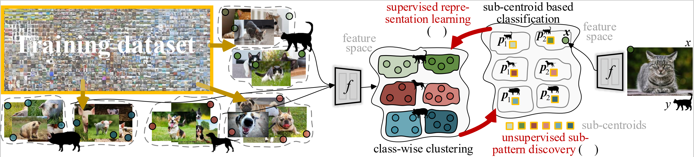

<!-- [](https://github.com/NVlabs/SegFormer/blob/master/LICENSE) -->


# DNC: Visual Recognition with Deep Nearest Centroids (Under construction)

<!--  -->
<div align="center">
  
</div>
<p align="center">
  Figure 1: With a distance-/case-based classification scheme, DNC combines unsupervised sub-pattern discovery and supervised representation learning in a synergy.
</p>

<!-- ### [Project page](https://github.com/NVlabs/SegFormer) | [Paper](https://arxiv.org/abs/2105.15203) | [Demo (Youtube)](https://www.youtube.com/watch?v=J0MoRQzZe8U) | [Demo (Bilibili)](https://www.bilibili.com/video/BV1MV41147Ko/) -->

DNC: Visual Recognition with Deep Nearest Centroids<br>
<!-- [Enze Xie](https://xieenze.github.io/), [Wenhai Wang](https://whai362.github.io/), [Zhiding Yu](https://chrisding.github.io/), [Anima Anandkumar](http://tensorlab.cms.caltech.edu/users/anima/), [Jose M. Alvarez](https://rsu.data61.csiro.au/people/jalvarez/), and [Ping Luo](http://luoping.me/).<br>
NeurIPS 2021. -->

This repository is the official Pytorch implementation of training & evaluation code and corresponding pretrained models for DNC.
<!-- [DNC](https://arxiv.org/abs/2105.15203). -->

We use [MMClassification v0.18.0](https://github.com/open-mmlab/mmclassification/tree/v0.18.0) and [MMSegmentation v0.20.2](https://github.com/open-mmlab/mmsegmentation/tree/v0.20.2) as the codebase.


## Abstract
We devise deep nearest centroids (DNC), a conceptually elegant yet surprisingly effective network for large-scale visual recognition, by revisiting Nearest Centroids, one of the most classic and simple classifiers. Current deep models learn the classifier in a fully parametric manner, ignoring the latent data structure and lacking simplicity and explainability. DNC instead conducts nonparametric, case-based reasoning; it utilizes sub-centroids of training samples to describe class distributions and clearly explains the classification as the proximity of test data and the class sub-centroids in the feature space. Due to the distance-based nature, the network output dimensionality is flexible, and all the learnable parameters are only for data embedding. That means all the knowledge learnt for ImageNet classification can be completely transferred for pixel recognition learning, under the ‘pre-training and fine-tuning’ paradigm. Apart from its nested simplicity and intuitive decision-making mechanism, DNC can even possess ad-hoc explainability when the sub-centroids are selected as actual training images that humans can view and inspect. Compared with parametric counterparts, DNC performs better on image classification (CIFAR-10, ImageNet) and greatly boots pixel recognition (ADE20K, Cityscapes), with improved transparency and fewer learnable parameters, using various network architectures (ResNet, Swin) and segmentation models (FCN, DeepLabV3, Swin). We feel this work brings fundamental insights into related fields.


## Installation

For installation and data preparation, please refer to the guidelines in [MMClassification v0.18.0](https://github.com/open-mmlab/mmclassification/tree/v0.18.0) and [MMSegmentation v0.20.2](https://github.com/open-mmlab/mmsegmentation/tree/v0.20.2).

I do my installation on ```CUDA 11.4``` and  ```pytorch 1.8.1``` 

```
pip install torchvision==0.9.1
pip install timm==0.3.2
pip install mmcv-full==1.4.1
pip install opencv-python==4.5.1.48
cd DNC_classification && pip install -e . --user
```

<!-- cd .. -->
<!-- cd DNC_segmentation && pip install -e . --user -->

<!-- ## Evaluation

Download [trained weights](https://drive.google.com/drive/folders/1GAku0G0iR9DsBxCbfENWMJ27c5lYUeQA?usp=sharing).

Example: evaluate ```SegFormer-B1``` on ```ADE20K```:

```
# Single-gpu testing
python tools/test.py local_configs/segformer/B1/segformer.b1.512x512.ade.160k.py /path/to/checkpoint_file

# Multi-gpu testing
./tools/dist_test.sh local_configs/segformer/B1/segformer.b1.512x512.ade.160k.py /path/to/checkpoint_file <GPU_NUM>

# Multi-gpu, multi-scale testing
tools/dist_test.sh local_configs/segformer/B1/segformer.b1.512x512.ade.160k.py /path/to/checkpoint_file <GPU_NUM> --aug-test
```

## Training

Download [weights](https://drive.google.com/drive/folders/1b7bwrInTW4VLEm27YawHOAMSMikga2Ia?usp=sharing) pretrained on ImageNet-1K, and put them in a folder ```pretrained/```.

Example: train ```SegFormer-B1``` on ```ADE20K```:

```
# Single-gpu training
python tools/train.py local_configs/segformer/B1/segformer.b1.512x512.ade.160k.py 

# Multi-gpu training
./tools/dist_train.sh local_configs/segformer/B1/segformer.b1.512x512.ade.160k.py <GPU_NUM>
```

## Testing
```
# Single-gpu training
python tools/train.py local_configs/segformer/B1/segformer.b1.512x512.ade.160k.py 

# Multi-gpu testing on ADE20K and COCO-10k
./tools/dist_test.sh local_configs.py saved_pth_path.pth <GPU_NUM> --aug-test --eval mIoU

# Multi-gpu testing on Cityscapes
./tools/dist_test.sh local_configs.py saved_pth_path.pth <GPU_NUM> --aug-test --eval cityscapes

```

## Visualize

Here is a demo script to test a single image. More details refer to [MMSegmentation's Doc](https://mmsegmentation.readthedocs.io/en/latest/get_started.html).

```shell
python demo/image_demo.py ${IMAGE_FILE} ${CONFIG_FILE} ${CHECKPOINT_FILE} [--device ${DEVICE_NAME}] [--palette-thr ${PALETTE}]
```

Example: visualize ```SegFormer-B1``` on ```CityScapes```: 

```shell
python demo/image_demo.py demo/demo.png local_configs/segformer/B1/segformer.b1.512x512.ade.160k.py \
/path/to/checkpoint_file --device cuda:0 --palette cityscapes
```


## License
Please check the LICENSE file. SegFormer may be used non-commercially, meaning for research or 
evaluation purposes only. For business inquiries, please contact 
[researchinquiries@nvidia.com](mailto:researchinquiries@nvidia.com).


## Citation
```
@article{xie2021segformer,
  title={SegFormer: Simple and Efficient Design for Semantic Segmentation with Transformers},
  author={Xie, Enze and Wang, Wenhai and Yu, Zhiding and Anandkumar, Anima and Alvarez, Jose M and Luo, Ping},
  journal={arXiv preprint arXiv:2105.15203},
  year={2021}
}
``` -->
